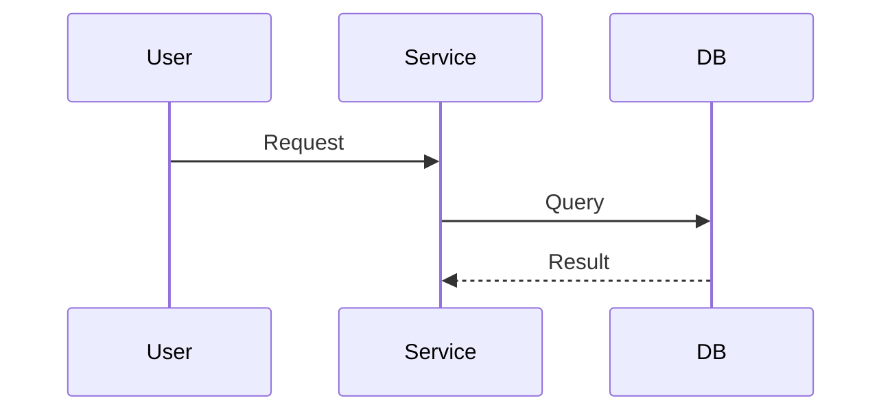

---
tags:
- module
- architecture
date: <% tp.date.now("YYYY-MM-DD") %>
title: Module Design
created: '2025-05-23'
description: ''
status: draft
system: ''
owner: ''
---

# 🧱 Module Design: <% tp.file.title %>

## 🧾 Overview
_What does this module handle?_

## 🧠 Interfaces
- Input:
- Output:

## 🔄 Workflow

## **📌 Notes**
- 