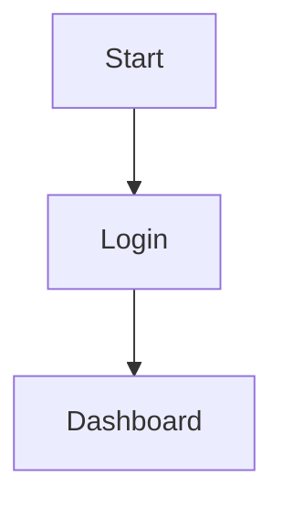

---
tags:
- product
- feature-spec
status: Draft
date:
- <% tp.date.now("YYYY-MM-DD") %>
title: Feature Spec
created: '2025-05-23'
description: ''
system: ''
owner: ''
---

# ✨ Feature Spec: <% tp.file.title %>

## 🔍 Overview
_What does this feature do and why does it exist?_
- 

## 🔧 Scope
_Inclusions and exclusions_
- 

## 👥 Target User
- 

## 🧠 User Stories
- As a _[user]_, I want to _[action]_ so that _[value]_.

## 🛠️ Functional Details
- 

## 🎨 UX Considerations
- 

## **🧪 Test Scenarios**
- 

## 🧪 QA Notes
- 

## 🔗 Links
- 

## 🔄 User Flow

## **🔗 Related Requirement**
- 