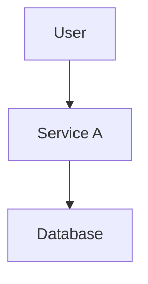

---
tags:
- architecture
- diagram
status: draft
date: <% tp.date.now("YYYY-MM-DD") %>
title: Data Flow Diagram
created: '2025-05-23'
description: ''
system: ''
owner: ''
---

# 📊 Data Flow Diagram: <% tp.file.title %>

## 📍 Context
- 

## 🔄 Data Flow Overview
_Describe how data moves between components._

## 🧱 Entities & Services

| Entity | Role                 |
| ------ | -------------------- |
| _user_ | _consumes service A_ |

## 🖼️ Diagram

## **📌 Notes**
- 